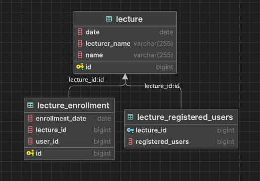

# hhplus-week2-lecture-service-arumkim

항해 플러스백엔드 6기 2주차 : 특강 신청 서비스

# ✅ TODO

### **`Default`**

- [x] 아키텍처 준수를 위한 애플리케이션 패키지 설계
- [x] 특강 도메인 테이블 설계 및 목록/신청 등 기본 기능 구현
- [x] 각 기능에 대한 **단위 테스트** 작성

> 사용자 회원가입/로그인 기능은 구현하지 않습니다.
>

### **`STEP 3`**

- [x] 설계한 테이블에 대한 **ERD** 및 이유를 설명하는 **README** 작성
- [x] 선착순 30명 이후의 신청자의 경우 실패하도록 개선
- [x] 동시에 동일한 특강에 대해 40명이 신청했을 때, 30명만 성공하는 것을 검증하는 **통합 테스트** 작성

### **`STEP 4`**

- [x] 같은 사용자가 동일한 특강에 대해 신청 성공하지 못하도록 개선
- [x] 동일한 유저 정보로 같은 특강을 5번 신청했을 때, 1번만 성공하는 것을 검증하는 **통합 테스트** 작성

--- 

### 클린 레이어드 아키텍처 패키지 구조

```
├── LectureServiceApplication.java
├── application
│   └── LectureService.java
├── domain
│   ├── Lecture.java
│   ├── LectureEnrollment.java
│   └── repository
│       ├── LectureEnrollmentRepository.java
│       └── LectureRepository.java
├── infrastrictire
│   └── repository
└── interfaces
    ├── api
    │   └── LectureController.java
    ├── dto
    │   ├── LectureEnrollmentResponseDto.java
    │   ├── LectureRequestDto.java
    │   └── LectureResponseDto.java
    └── exception
        └── ErrorMessage.java

```

# 🗂️ ERD



## 데이터베이스 구조

### 1. Lecture 테이블

- **컬럼**
    - `id`: 강의의 고유 식별자
    - `name`: 강의명
    - `lecturer_name`: 강사 이름
    - `date`: 강의 날짜

- **설계 이유**
    - 강의 정보를 중앙에서 관리하기 위해 설계. 
    - 각 강의에 대한 기본 정보를 한 곳에서 관리하면 데이터의 일관성과 무결성을 유지할 수 있다.     
      이 구조는 강의 조회 및 관리 작업을 효율적으로 만들고, 시스템 확장 시 유연성을 제공한다.

### 2. Lecture_Enrollment 테이블

- **컬럼**
    - `id`: 등록의 고유 식별자
    - `lecture_id`: 어떤 강의에 등록했는지를 나타내는 외래 키
    - `user_id`: 등록한 사용자의 ID
    - `enrollment_date`: 등록 날짜

- **설계 이유**
    - 사용자의 강의 등록 정보를 명확하게 관리하기 위해 설계. 
    - 강의와 사용자의 관계를 쉽게 추적하고, 중복 등록을 방지하며 강의별 등록자 수를 확인하는 데 유용하도록 함

### 3. Lecture_Registered_Users 테이블
- **컬럼**
    - `lecture_id`: 강의 ID
    - `registered_users`: 해당 강의에 등록된 사용자 ID

- **설계 이유**
    - 특정 강의에 등록된 사용자들의 목록을 관리하기 위해 설계 
    - 이 테이블은 강의의 등록 현황을 효과적으로 추적할 수 있도록 도와준다. 강의별 등록자의 목록을 통해 관리자가 등록된 사용자를 쉽게 확인할 수 있고, 정원 초과 여부를 판단하는 역할도 한다.

### 정리
`Lecture` 테이블은 강의에 대한 기본 정보를 담고, `Lecture_Enrollment` 테이블은 사용자와 강의 간의 관계를 나타낸다.   
마지막으로, `Lecture_Registered_Users` 테이블은 강의별 등록자를 관리하여 강의 정원 초과 여부를 쉽게 확인할 수 있도록 돕는다. 
